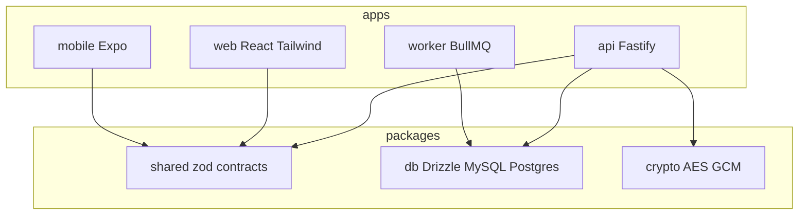

# SaaS Starter Pack

Multi-tenant starter monorepo: **Fastify** API, **React** web (Vite + Tailwind), **Expo** mobile, **BullMQ** worker, **Redis**, **Drizzle** (PostgreSQL or MySQL).

## Documentation

| | |
|--|--|
| **Coding assistants** | **[`AGENTS.md`](AGENTS.md)** — read order, repo map, golden paths, invariants |
| **Cursor rules** | **[`.cursor/rules/`](.cursor/rules/README.md)** — always-on gates + web UI conventions (loaded by Cursor) |
| **Editable docs (Markdown)** | **[`docs/README.md`](docs/README.md)** — guidelines hub, module specs, ADRs, runbooks |
| **Coding guidelines** | [`docs/guidelines/README.md`](docs/guidelines/README.md) — architecture, security, testing, collaboration |
| **In-code documentation** | [`docs/guidelines/source-documentation.md`](docs/guidelines/source-documentation.md) — file headers and TSDoc standards |
| **Collaboration / prompts** | [`docs/guidelines/prompt-principles.md`](docs/guidelines/prompt-principles.md) — design involvement, requirement clarification |
| **Canonical vocabulary** | [`docs/guidelines/glossary.md`](docs/guidelines/glossary.md) — tenant vs realm, roles, auth terms |
| **Browser overview** | Open [`docs/index.html`](docs/index.html) locally (styled reference; overlaps with Markdown) |
| **Environment template** | [`.env.example`](.env.example) |

Non-trivial behavior is also described in **file-level comments** next to the code — see [`docs/guidelines/source-documentation.md`](docs/guidelines/source-documentation.md) for the required header and TSDoc standards (`apps/api`, `packages/db`, `packages/crypto`, etc.).

## Quick start

```bash
cp .env.example .env   # repo root — API/worker load this even from apps/*
pnpm install
# Start Postgres or MySQL + Redis (e.g. docker compose --profile postgres up)
pnpm dev:all           # web + API + worker
```

- Web: typically **http://localhost:5173** — API URL follows root **`.env`** **`API_PORT`** (legacy **`PORT`**) unless **`VITE_API_BASE_URL`** is set (see `docs/guidelines/development.md`).
- API: **`API_PORT`** from `.env` (see `docs/guidelines/environment.md`).

## Root scripts

| Script | Runs |
|--------|------|
| `pnpm dev` | API only |
| `pnpm dev:all` | Web + API + worker (parallel) |
| `pnpm dev:web` / `pnpm dev:worker` / `pnpm dev:mobile` | Single app |
| `pnpm -r typecheck` / `build` / `test` / `lint` | All workspace packages |
| `pnpm verify` | **Typecheck + test** (recommended before PRs) |
| `pnpm build:ci` | **`verify`** then **`pnpm -r build`** (CI-style gate) |
| `pnpm build:api` / `build:web` / `build:worker` | Hostinger Web App role builds (repo root; see [`docs/runbooks/deploy.md`](docs/runbooks/deploy.md)) |
| `pnpm start:api` / `start:worker` | Run compiled API or worker after the matching `build:*` |
| `pnpm test:watch` | Web **Vitest** watch mode |

## Architecture (high level)



Full layout and roles: **`docs/guidelines/architecture.md`** and **`docs/guidelines/authentication.md`**.
