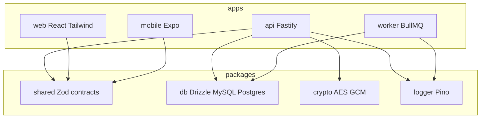

# Architecture

## Monorepo model

This repository is a **pnpm workspace**: runnable apps under `apps/*`, shared libraries under `packages/*`. The **API** owns authentication, tenant scoping, persistence, and optional background job enqueue. **Web** and **mobile** are HTTPS clients; they should not duplicate business rules that belong on the server.

## Domain-driven design (DDD)

Where practical, we follow **Domain-Driven Design (DDD)** — ubiquitous language, bounded contexts, and clear boundaries between domain logic, application orchestration, and infrastructure.

**How that shows up here**

- **Ubiquitous language** — Product and code use the same terms; the canonical list is **[glossary.md](glossary.md)**. Prefer updating the glossary over inventing new synonyms in UI or routes.
- **Bounded contexts** — **Tenant (realm)** operations vs **platform** (super admin, no tenant) are different security and data scopes; keep rules and types explicit per context. **API** vs **worker** vs **clients** are delivery boundaries: domain invariants live server-side; clients validate for UX only.
- **Shared kernel** — **`packages/shared`** (Zod + types) is the contract at system edges; **`packages/db`** is persistence. Grow richer domain behavior in **`packages/*`** (and focused modules under `apps/api`) rather than scattering rules across route handlers as the product grows.
- **Pragmatism** — We do **not** require full tactical DDD (aggregates, domain events everywhere) from day one. Introduce those patterns when a subdomain gains enough complexity to justify them; until then, keep **thin routes + explicit repos + shared vocabulary**.

## System diagram

External services: **PostgreSQL or MySQL**, **Redis** (BullMQ transport + API producer connection).

## Workspace layout

| Path | Role |
|------|------|
| `apps/api` | Fastify: JWT auth routes, profile routes, optional BullMQ enqueue, startup migrations/bootstrap |
| `apps/worker` | BullMQ consumer; **queue name must match** the API email queue helper |
| `apps/web` | Vite + React + Tailwind SPA |
| `apps/mobile` | Expo client (example: SecureStore for refresh token) |
| `packages/db` | Drizzle schemas (`pg` / `mysql`), repos, SQL migrations, `database-url` helper |
| `packages/crypto` | AES-256-GCM field encryption helpers |
| `packages/shared` | **Zod request schemas** and shared TypeScript types (keep API and clients aligned) |
| `packages/logger` | Pino logger factory and log level resolution (API + worker) |

## Multi-tenancy (conceptual)

Canonical vocabulary: **[glossary.md](glossary.md)**.

- **Realms** are rows in `tenants`; most **users** have a non-null `tenant_id` and a role of `tenant_admin` or `tenant_user`.
- **Platform super admins** have `tenant_id` **NULL** and role `super_admin`; JWTs for that session omit `tenantId`.
- Repositories scope queries by tenant where applicable; see `packages/db/src/repos.ts` for `identity_key` (`{tenantId}:{email}` vs `SUPER:{email}` for platform users).

## Realm subscriptions (billing subject)

- **Bounded context** — Catalog and platform-wide toggles stay under **super-admin** (`/platform/subscriptions/*`). **Realm subscription instances** (`subscriptions` table) are created and canceled by **tenant administrators** (organization-wide plan, `billing_scope = tenant`) or **individual members** (per-seat plan, `billing_scope = user`) via **`/tenant/subscription/*`** and **`/account/subscription/*`** respectively.
- **Plan deletion vs ledger** — **`DELETE /platform/subscriptions/plans/:planId`** is rejected (**409**) when **subscription payment rows** reference the tier (`plan_cannot_delete_has_ledger`) or when **subscriptions** reference it as **`plan_id`** or **`pending_plan_id`** (`plan_in_use`). Use **`POST /platform/subscriptions/plans/:planId/disabled`** with `{ "disabled": true }` to **soft-disable** the tier: it disappears from **subscriber catalogs** but **`platform_subscription_payments.plan_id`** (and subscription rows) keep a stable link for audit. **`{ "disabled": false }`** re-enables catalog listing.
- **Period model (v1)** — Rolling **monthly** anchor in **UTC** (`addMonthsUtc` in `@starter/shared`); only **one-month** catalog tiers are eligible for self-serve subscribe until day/year SKUs are enabled.
- **Cancellation** — If the plan allows **cancel any day**, the subscriber chooses **immediate** vs **end of current period**; otherwise only **period end** is accepted. Money movement is expected via the **payment service provider**; app rows track state for reconciliation.
- **Trials (catalog)** — Each **`platform_subscription_plans`** row may set **`trial_days`** (0–365 calendar days, UTC via `addDaysUtc`). Subscriptions created on that tier get **`trial_ends_at`**; **no** initial `platform_subscription_payments` row is inserted until the **worker** bills after the trial (same pattern as renewals).
- **Upgrade / downgrade (next period)** — Plan flag **`allow_tier_change_next_period`** gates whether subscribers may schedule a switch. **`subscriptions.pending_plan_id`** holds the target catalog tier; **`applyPendingPlanChangeForSubscriptionId`** in `@starter/db` moves it onto **`plan_id`** when the billing worker rolls the period (subscriber APIs: **`POST …/subscription/schedule-plan-change`**, **`DELETE …/subscription/scheduled-plan-change`**).
- **Coupons, %-off, mid-cycle proration** — **Not** in v1 data model; use the PSP or add future columns if product requires them.
- **Tax & invoicing (B2B)** — **Deferred to the payment service provider (PSP).** This module owns the **subscription catalog** (`platform_subscription_plans`), **subscription instances** (`subscriptions`), and **internal payment plan / ledger rows** (`platform_subscription_payments` — amounts, status, due dates, reconciliation fields). It does **not** implement VAT/GST IDs, statutory **invoice PDFs**, **sequential invoice numbers**, or **credit notes** as first-class app artifacts; those live in the PSP (or a future dedicated invoicing integration), with optional correlation via PSP invoice / customer IDs when you extend the schema.
- **UI placement** — Tenant-wide subscription: **Admin → System → Subscription** tab. Per-user subscription: **Settings → Subscription** tab (realm sessions only). Super-admin catalog: **Subscription tier** modal (trial + tier-change flags).

### Payment ledger (`platform_subscription_payments`)

| Path | Responsibility |
|------|----------------|
| **In-repo (sync)** | `insertPlatformSubscriptionPayment` in `packages/db/src/platform-subscription-repos.ts` — used by `insertSubscriptionWithFirstPayment` to record the **initial** charge line when a realm subscription is created **and the plan has `trial_days = 0`**. |
| **Queued worker (async)** | **Renewals**, **period roll-forward**, **catch-up/backfill**, and **high-volume generation** should run in **`apps/worker`** on **BullMQ** (same Redis contract as email jobs): throttle **worker concurrency** so DB and PSP are not hammered; process **batches** (on the order of **~1000 subscription IDs per job** or per DB transaction slice—tune to statement timeout and PSP rate limits). Split “calculate due periods” from “call PSP / finalize row” if retries differ. |
| **Idempotency** | The table has no unique constraint on “one row per subscription per period” yet; **workers must not double-insert** the same logical invoice (e.g. use a **pre-insert existence check** keyed by `subscription_id` + period boundary, or **`jobId` / dedupe key** in BullMQ, or a future **`external_id`** / **`psp_invoice_id`** column with a **unique index**). |
| **PSP correlation & dunning** | **Target (recorded below):** first-class **`psp_*`** ids on subscriptions and ledger rows, plus **subscription-level dunning fields** updated from webhooks/jobs. **Interim:** until migrated, store a stable correlation token in **`description`** (e.g. short JSON: `{"kind":"renewal","periodStart":"…","pspIntent":"…"}`) **or** link from your PSP dashboard using **`platform_subscription_payments.id`** as client reference. **Retry cadence** stays **PSP-led** where possible; **retry and dunning** application logic lives in the worker + PSP webhooks (or a dedicated payment service), not in synchronous HTTP handlers. |

Operational detail: **[best-practices.md](best-practices.md)** (*Subscription payment generation*). Queue naming should follow the same **`{prod|dev}-…`** pattern as the email queue when you add a **`subscription-billing`** (or similarly named) queue.

### Subscription billing decisions (numbered for reference)

When extending PSP + worker behavior, refer to options as **`{row}{letter}`** (e.g. **`1A`** = row **1**, option **A**).

| # | Topic | A | B | C |
|---|--------|---|---|---|
| **1** | **PSP webhooks** (paid / failed / chargeback) | Dedicated **HTTP routes on `apps/api`** (verify signature, enqueue BullMQ to update ledger rows) | **Worker-only** long-poll / PSP SDK pull (no public webhook URL) | **Separate payment microservice** owns PSP + emits events the API/worker consumes |
| **2** | **DB idempotency** (first migration) | **Unique** on `(subscription_id, period_start_utc)` (design for nullable / non-subscription rows as needed) | **Unique** on `psp_invoice_id` / `external_id` only | **No unique column yet** — BullMQ `jobId` + `SELECT` before `INSERT` only |
| **3** | **Batch job shape** | **Scheduler** enqueues one job per **chunk** of ~1000 subscription ids (cursor / shard in payload) | **Fan-out**: parent loads range; **child** jobs one subscription each | **Hybrid**: chunk jobs for listing; **child** only where per-subscription PSP isolation matters |

**Recorded answers (product owner):** **`1A`**, **`2A`**, **`3C`** — API webhook endpoints that verify PSP signatures and enqueue work; prefer a DB unique on subscription + period when migrating; hybrid chunk + targeted child jobs for PSP-heavy steps.

### PSP linkage, subscriber payment UX, and dunning (product owner)

These choices use **lowercase letters** per row (independent picks, e.g. **`d`**, **`g`**, **`j`**).

| Row | Topic | Options (pick one per row) | Recorded |
|-----|--------|----------------------------|----------|
| **1** | **PSP identity & ledger correlation** | **a** — Minimal metadata only · **b** — `psp_customer_id` only · **c** — customer + subscription/agreement ids (+ default PM ref) · **d** — **c** plus invoice / payment intent / charge ids on ledger where useful + read-only **PM summary** for admin | **`d`** |
| **2** | **“Update payment method” / receipts** | **e** — PSP-hosted portal/invoices only; PSP emails · **f** — **e** plus in-app status from webhooks; optional app emails linking to PSP · **g** — **Embedded** PM capture (Elements / Drop-in); PSP still holds PAN; optional portal for history | **`g`** |
| **3** | **Dunning / failed payments** | **h** — Ledger row statuses only · **i** — **h** + observe PSP retries; simple “billing issue” flag · **j** — **i** plus explicit **subscription-level** fields (`past_due_since`, failed-attempt count, last error, next retry, etc.) · **k** — **j** plus automated suspend/cancel rules | **`j`** (not **k**) |

**Summary:** Persist **deep PSP correlation** (**d**)—customer, recurring contract, key charge/invoice ids on ledger rows, and non-sensitive PM summary for support. Subscribers **update cards in-app** via PSP-hosted inputs (**g**). Model **failed payment / past-due** explicitly on the **subscription** row as well as the ledger (**j**); **automated** suspend/cancel after N failures (**k**) is **out of scope** until separately chosen and specified.

**Baseline shipped in repo:** migration **`0030_subscription_psp_and_dunning`** adds `subscriptions.psp_*`, PM summary, dunning counters, and `platform_subscription_payments.psp_*`. The API exposes **`POST /webhooks/stripe`** (raw body + signing secret), **`POST …/subscription/stripe/setup-intent`** (tenant-admin and account), creates a **Stripe Customer** after realm subscribe when Stripe is enabled, and updates ledger/subscription rows from **SetupIntent** / **PaymentIntent** webhooks. Subscriber UI uses **Stripe.js** Card Element + SetupIntent. Workers that create **PaymentIntents** should set **`psp_payment_intent_id`** on ledger rows and metadata `starter_subscription_id` / `starter_tenant_id` / `starter_payment_id` for correlation.

## Testing architecture

- **Unit tests** target pure and env-isolated logic: **`packages/shared`** (Zod + helpers), **`packages/db`** (dialect/env helpers), **`packages/logger`**, **`packages/crypto`**, small **`apps/api`** libs (e.g. token hashing), and **`apps/worker`** naming contracts — using Node’s **`node:test`** and **tsx** for TypeScript.
- **`apps/web`** uses **Vitest** so tests share Vite resolution (including the **`@starter/shared`** alias to source).
- **Orchestration** (`Fastify` route handlers) should stay thin; push rules into **repos, shared schemas, or `lib/`** modules so they are cheap to test without standing up HTTP.
- Commands and TDD workflow: **[testing.md](testing.md)** (`pnpm verify`, `pnpm build:ci`).

## Documentation vs code

Non-trivial behavior is explained in **file-level comments** next to the implementation (especially `apps/api`, `packages/db`, `packages/crypto`). Treat those comments as the **line-by-line** supplement; this `docs/` folder is for **cross-cutting** review and onboarding.
